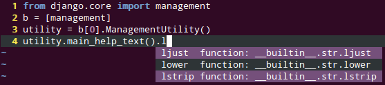

.. include global.rst

.. meta::
    :github_url: https://github.com/davidhalter/medi

Jedi - an awesome autocompletion, static analysis and refactoring library for Python
====================================================================================

.. image:: https://img.shields.io/github/stars/davidhalter/medi.svg?style=social&label=Star&maxAge=2592000
    :target: https://github.com/davidhalter/medi
    :alt: GitHub stars

.. image:: http://isitmaintained.com/badge/open/davidhalter/medi.svg
    :target: https://github.com/davidhalter/medi/issues
    :alt: The percentage of open issues and pull requests

.. image:: http://isitmaintained.com/badge/resolution/davidhalter/medi.svg
    :target: https://github.com/davidhalter/medi/issues
    :alt: The resolution time is the median time an issue or pull request stays open.

.. image:: https://travis-ci.org/davidhalter/medi.svg?branch=master
    :target: https://travis-ci.org/davidhalter/medi
    :alt: Linux Tests

.. image:: https://ci.appveyor.com/api/projects/status/mgva3bbawyma1new/branch/master?svg=true
    :target: https://ci.appveyor.com/project/davidhalter/medi/branch/master
    :alt: Windows Tests

.. image:: https://coveralls.io/repos/davidhalter/medi/badge.svg?branch=master
    :target: https://coveralls.io/r/davidhalter/medi
    :alt: Coverage status

`Github Repository <https://github.com/davidhalter/medi>`_

.. automodule:: medi

Autocompletion can for example look like this in medi-vim:

.. _toc:

Docs
----

.. toctree::
   :maxdepth: 1

   docs/usage
   docs/features
   docs/api
   docs/api-classes
   docs/installation
   docs/settings
   docs/development
   docs/testing
   docs/acknowledgements
   docs/changelog

.. _resources:

Resources
---------

- `Source Code on Github <https://github.com/davidhalter/medi>`_
- `Travis Testing <https://travis-ci.org/davidhalter/medi>`_
- `Python Package Index <https://pypi.python.org/pypi/medi/>`_
